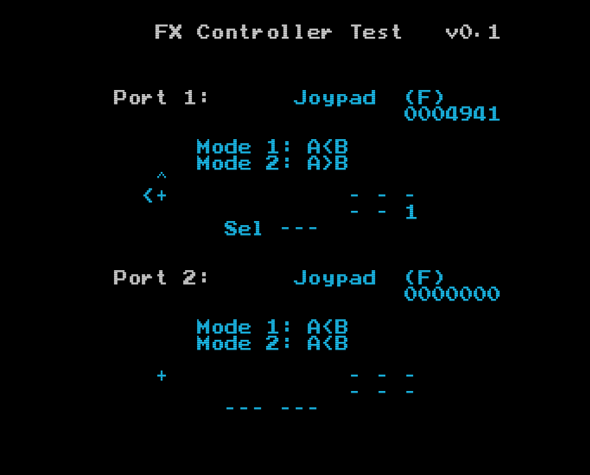
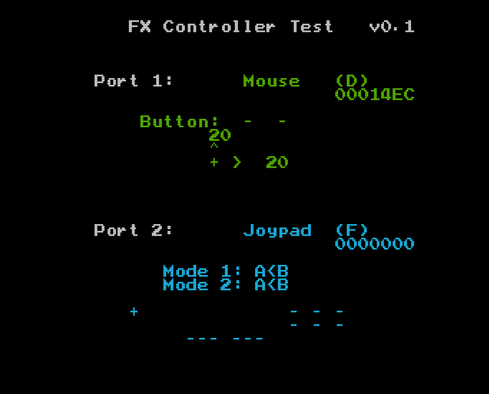

# PC-FX_Controller_Test

This is a program to test controllers for the PC-FX.
Recognizes Mouse and Joypad, and displays relevant information in "ASCII Art" format,
with different colors signifying different controller identifiers.

# Program Overview

The overall idea of this program is to be able to check whether your PC-FX and controllers are in
working order, and whether there are any issues with any of the buttons/switches.

It can also be used by people who are building PC-FX compatible joypad or mice.

Once the program starts, it checks both joypad ports to detect what kind of controller is plugged
in (if any). Depending on what types of device is connected, the text will be displayed in different
colours.

For joypads and mice, a pictorial view of the controls will be displayed, indicating which buttons
are pressed (or not pressed), as well as directional movement.

### Joypad display:

### Mouse display:

## How to use

Find the most recent date in the "src/RELEASE" folder, and use the files in there.

The most common approach would be to burn this to a disc; in this case, use the *.cue and *.bin files only.

If you have a fx_uploader, you can simply deploy the 'ctrlr' file through the data link.

## Development Chain & Tools

This was written using a version of gcc for V810 processor, with 'pcfxtools' which assist in
building executables for PC-FX, and 'liberis' which is a library of functions targetting the PC-FX.

These can be found here:\
\
\

